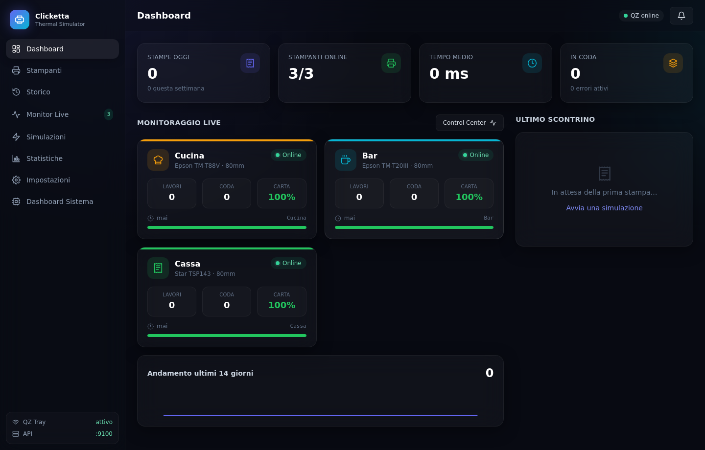
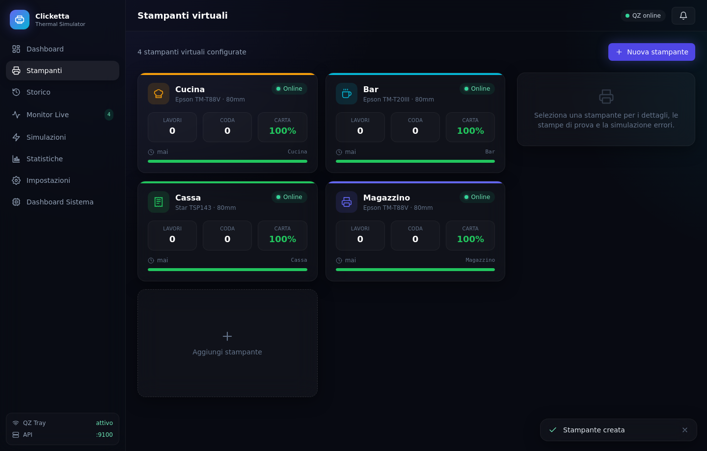
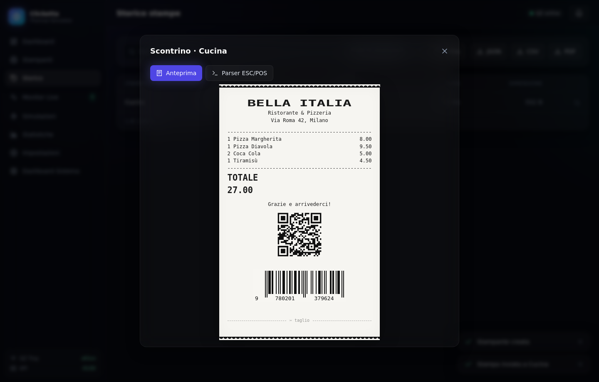
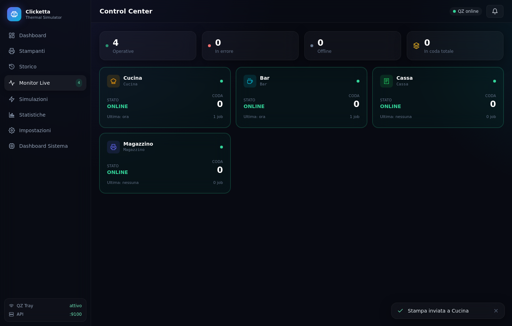
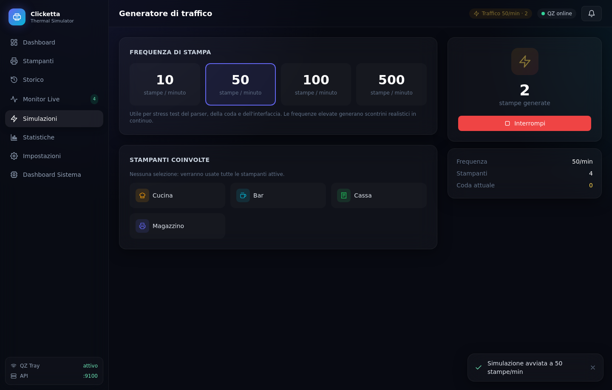
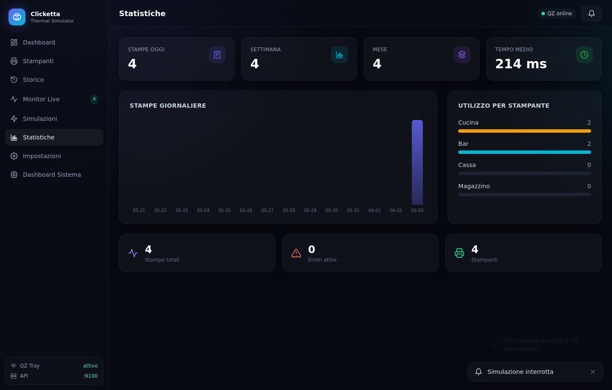
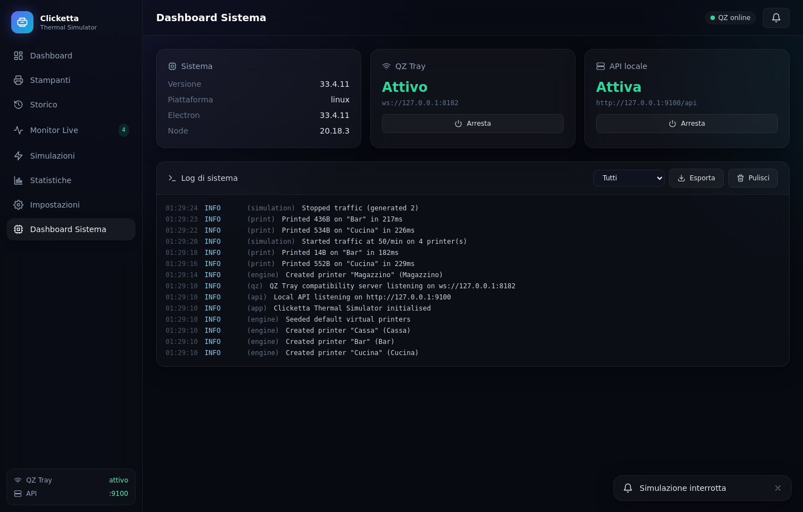

# Clicketta Thermal Simulator

Simulatore professionale di stampanti termiche **ESC/POS** compatibile con **QZ Tray**,
pensato per lo sviluppo, il debug, la formazione e le demo di software gestionali e POS
(Clicketta e qualsiasi altro software compatibile con QZ Tray).

Applicazione **desktop, completamente offline**, per Windows, Linux e macOS.



## Caratteristiche principali

- **Stampanti virtuali** — crea, modifica, duplica, elimina e attiva/disattiva stampanti
  con nome, descrizione, driver simulato, porta, larghezza carta (58/80 mm), identificativo,
  stato, colore e icona.
- **Layer compatibile QZ Tray** — le stampanti sono individuabili via `qz.printers.find()`
  e ricevono i dati inviati da `qz.print()` su WebSocket (`ws://127.0.0.1:8182`).
- **Parser ESC/POS** — interpreta i principali comandi: `ESC @`, `ESC E`, `ESC a`, `ESC p`,
  `ESC B`, `GS V`, `GS k` (barcode), `GS ( k` (QR), `ESC 3`, `ESC !`, `GS !`, `ESC d`,
  immagini raster `GS v 0` e altri.
- **Rendering realistico** — scontrini su carta termica con font monospace, grassetto, font
  multipli, allineamenti, separatori, **QR code reali** e **barcode reali**, immagini raster.
- **Animazioni ed effetti** — taglio carta, apertura cassetto e beep, con suoni sintetizzati
  configurabili.
- **Monitoraggio Live & Control Center** — tutte le stampanti in tempo reale (stato, ultima
  stampa, lavori, coda, carta residua, errori) con layout stile NOC.
- **Storico** — ogni stampa è memorizzata con raw, rendering e durata; ricerca, filtri ed
  esportazione **JSON / CSV / PDF**.
- **Simulazione errori** — carta terminata/quasi terminata, offline, non raggiungibile,
  coperchio aperto, buffer pieno, errore generico.
- **Statistiche** — stampe giornaliere/settimanali/mensili, utilizzo per stampante, tempo
  medio di elaborazione, numero errori, grafici in tempo reale.
- **Generatore di traffico** — 10 / 50 / 100 / 500 stampe al minuto per stress test.
- **API HTTP locale** — `GET /api/printers`, `POST /api/print`, `GET /api/history`,
  `GET /api/stats`, `GET /api/health`.
- **Logging centralizzato** — livelli DEBUG/INFO/WARNING/ERROR con esportazione.

## Stack tecnologico

Electron · Vue 3 · Vite · TypeScript · Pinia · TailwindCSS · SQLite (better-sqlite3)

## Architettura

```
Electron
├── Main Process        src/main/index.ts          ciclo di vita + finestra
│   ├── IPC Layer        src/main/ipc.ts            router invoke + broadcast eventi
│   ├── SQLite Layer     src/main/db/*              Store (SQLite | in-memory)
│   ├── ESC/POS Parser   src/main/escpos/*          parser + builder
│   ├── Virtual Engine   src/main/engine/*          PrinterManager + TrafficSimulator
│   ├── Local API Server src/main/server/apiServer  Express
│   └── QZ Server        src/main/server/qzServer   WebSocket compatibile QZ Tray
├── Preload Process     src/preload/index.ts        contextBridge tipizzato
├── Shared              src/shared/*                tipi + contratto IPC
└── Vue Frontend        src/renderer/*              UI (stores Pinia, viste, componenti)
```

### Schema database (SQLite)

`printers`, `print_jobs`, `print_history`, `simulated_errors`, `settings`, `statistics`, `logs`.

### Store Pinia

`useAppStore`, `usePrintersStore`, `useHistoryStore`, `useStatisticsStore`,
`useSimulationStore`, `useSettingsStore`.

## Avvio

```bash
npm install          # installa le dipendenze e ricompila better-sqlite3 per Electron
npm run dev          # avvia l'app in sviluppo (hot reload)
npm run build        # typecheck + build di produzione
npm run build:linux  # (oppure :win / :mac) crea il pacchetto distribuibile
```

## Integrazione QZ Tray

Il client `qz-tray.js` può puntare all'endpoint insecuro del simulatore:

```js
qz.websocket.connect({ host: '127.0.0.1', usingSecure: false })   // porta 8182
await qz.printers.find('Cucina')
await qz.print(qz.configs.create('Cucina'), [
  { type: 'raw', format: 'base64', data: '<payload ESC/POS in base64>' }
])
```

## API locale (esempi)

```bash
curl http://127.0.0.1:9100/api/printers
curl -X POST http://127.0.0.1:9100/api/print \
  -H 'Content-Type: application/json' \
  -d '{"printer":"Cucina","data":"<base64 ESC/POS>","encoding":"base64"}'
curl http://127.0.0.1:9100/api/history
curl http://127.0.0.1:9100/api/stats
```

## Test

Il progetto è coperto da test unitari (Vitest) e test end-to-end (Playwright + Electron).

```bash
npm run test         # 52 test unitari: parser, builder, engine, QZ, API, store, export
npm run test:e2e     # build + e2e Electron (su Linux headless: xvfb-run npm run test:e2e)
```

I test e2e avviano l'app reale, creano una stampante, inviano una stampa, verificano il
rendering dello scontrino, l'API HTTP e il WebSocket QZ Tray, e catturano gli screenshot.

## Anteprima

| Stampanti | Storico & scontrino | Control Center |
|---|---|---|
|  |  |  |

| Simulazioni | Statistiche | Sistema |
|---|---|---|
|  |  |  |

## Autore

Realizzato da **[Regna Royal Tech](https://regna.tech)**.

## Licenza

Software **gratuito** con **licenza proprietaria**.

Copyright © Regna Royal Tech — [regna.tech](https://regna.tech). Tutti i diritti riservati.

Il software è distribuito gratuitamente. Non sono concessi i diritti di
modifica, redistribuzione o rivendita senza autorizzazione scritta di
Regna Royal Tech. Vedi il file [`LICENSE`](LICENSE) per il testo completo.
